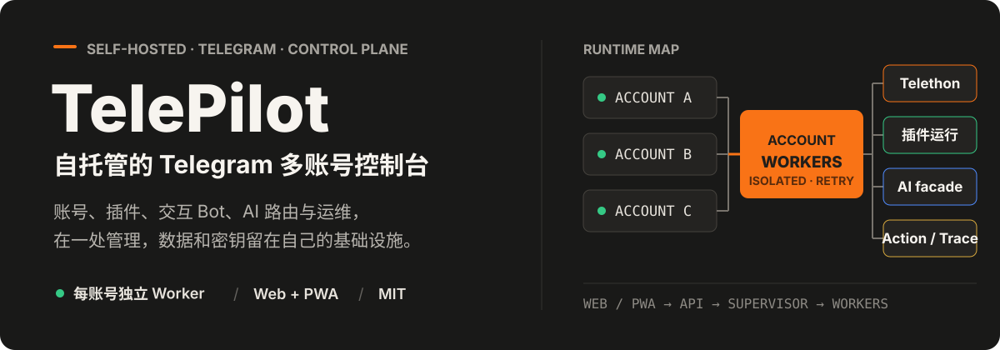
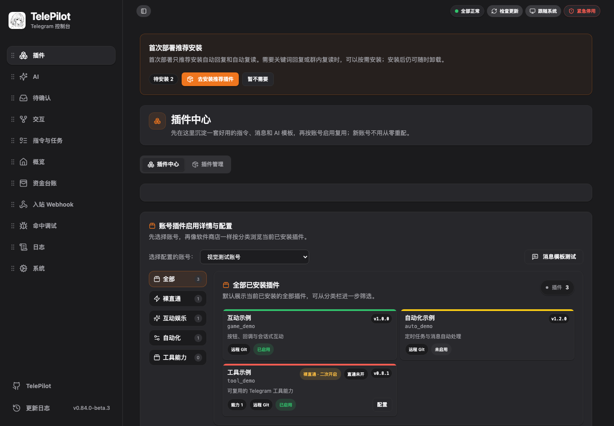
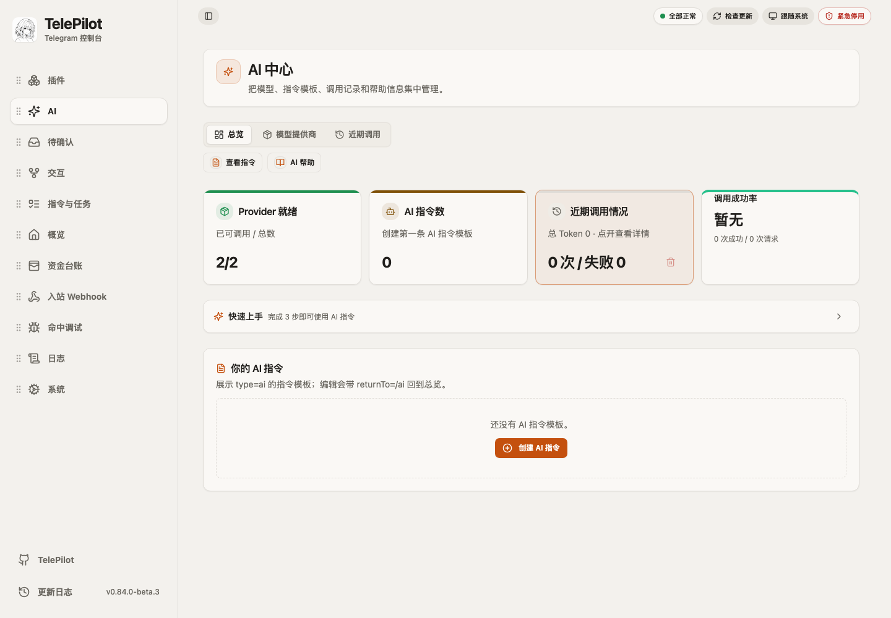
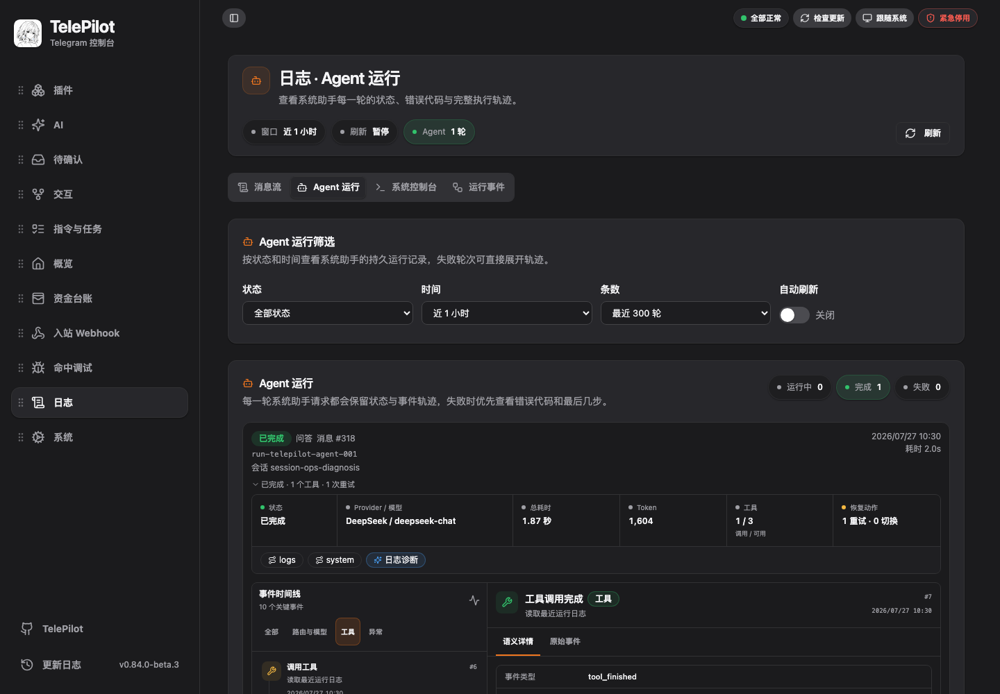
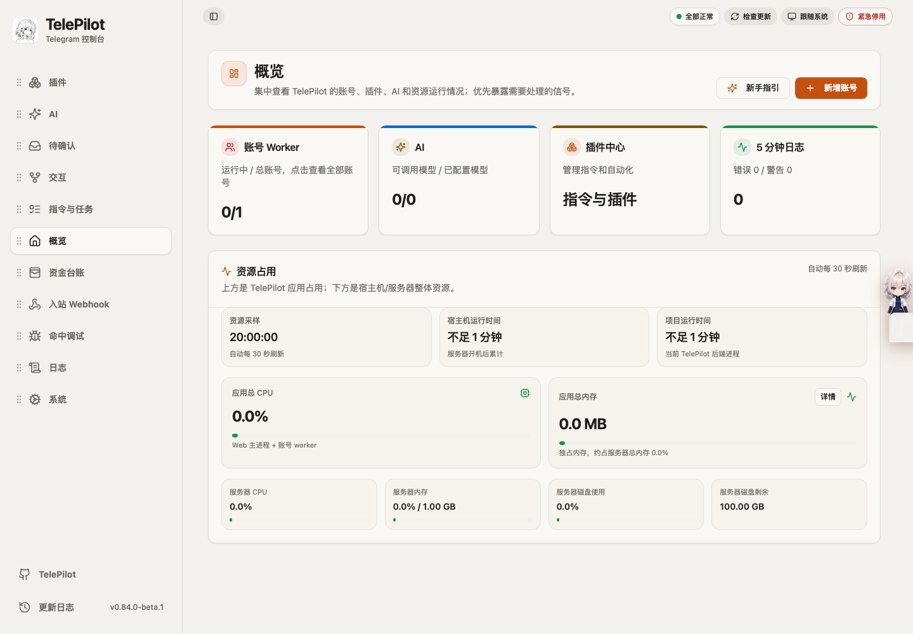
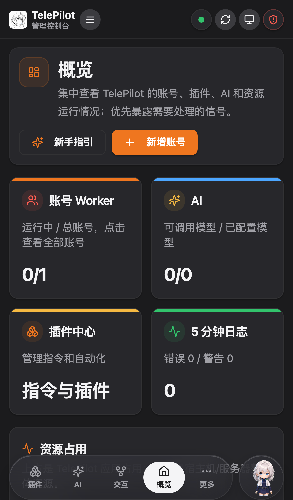
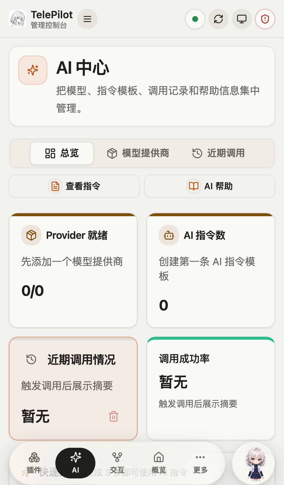
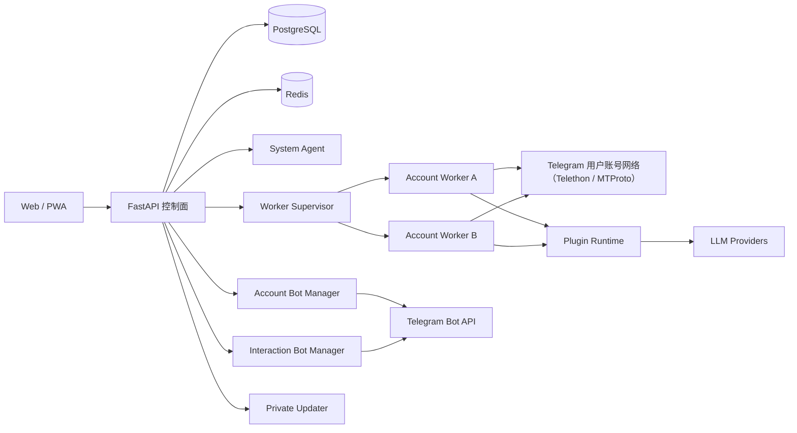

<p align="center">
  
</p>

<p align="center">
  <a href="#快速开始"></a>
  <a href="./backend/pyproject.toml"></a>
  <a href="./frontend/package.json"></a>
  <a href="./LICENSE"></a>
</p>

<p align="center">
  <strong>把 Telegram 账号、插件、交互 Bot、AI、资金动作与运维放进一个自己掌控的 Web/PWA 工作台。</strong>
</p>

TelePilot 面向需要自托管 Telegram 自动化的个人用户和小团队。每个 Telegram 用户账号由独立 Worker 子进程运行，拥有自己的 session、代理、设备参数和插件配置；FastAPI 控制面统一管理配置、权限、运行状态、日志、在线更新和安全边界。

> [!IMPORTANT]
> TelePilot 操作的是 Telegram **用户账号**，不是普通 Bot API 托管服务。自动回复、群发、频繁操作和第三方插件可能触发账号风控，也可能带来数据与资金风险。请在理解后使用，并遵守 Telegram 规则和当地法律。

## 当前界面

插件中心是当前默认入口。先沉淀可复用的指令、消息和 AI 模板，再按账号启用，新账号不需要重复配置。

<p align="center">
  
</p>

<p align="center">
  
  
</p>

<details>
<summary><strong>查看概览与 PWA 移动端</strong></summary>

<br>

<p align="center">
  
</p>

<p align="center">
  
  
</p>

</details>

## 当前能力

| 工作台 | 当前实现 |
| --- | --- |
| 插件 | 内置插件、本地导入、ZIP 安装和 Git 远程仓库；支持签名策略、权限声明、版本检查、全局安装、按账号启停、配置页和 Worker 热重载 |
| AI | OpenAI Chat Completions、OpenAI Responses、Anthropic Messages 与 Ollama 兼容协议；支持模型发现、测活、路由标签、客户端身份、加密兼容请求头、调用记录、Token 与预算 |
| 系统助手与待确认 | Web 悬浮助手和管理 Bot `/agent` 共用可恢复 Durable Run；思考与正文分流、工具渐进披露、同 Provider 重试与 fallback、公开网页读取、源码只读诊断、长期记忆和写操作 Action 确认 |
| 交互 | 独立 Interaction Bot manager 承接关键词、付款确认、按钮回调和群会话；会话状态持久化，命令入口仍可走用户账号通道 |
| 指令与任务 | 消息模板、AI 指令、定时任务和自动命令白名单集中在一级工作台，支持按账号启用和立即执行 |
| 账号与概览 | Web 向导绑定 Telegram 账号，管理代理、设备参数、Account Bot 和账号功能；Supervisor 负责启动、停止、重连、退避与资源状态 |
| 资金台账 | Action ledger、按账号查询、统计与导出、payout 限额、持久化幂等、失败补偿和 ambiguous 人工核对 |
| 入站 Webhook | 外部系统通过账号级加密 Token 投递标准事件，支持限流、去重、平台开关和 Worker 投递 |
| 命中调试 | 模拟消息路由、查看规则与插件命中结果，按短 TTL 打开 router debug trace，并支持录制与离线回放 |
| 日志 | 消息流、Agent 运行、系统控制台和运行事件分视图；提供 Runtime/Audit 日志、Event Trace、reason code、原始事件与关联下钻 |
| 系统 | AI、交互、Webhook、台账和命中调试可热关闭与恢复；提供系统健康、全局紧急停用、配置导出、备份恢复和在线增量更新 |

### System Agent 当前链路

System Agent 不直接获得数据库、Shell 或任意文件访问权。它先按请求选择领域和 Skill，每轮最多加载两个领域 Skill、暴露十六个工具；只读工具直接执行，写工具先生成待确认 Action，再由统一执行器提交。日志中心的 Agent 视角会保留 Provider、模型、路由、Skill、工具、重试、Token 和阶段耗时，刷新后仍能按持久 Run 恢复。

联网搜索与 URL 读取使用独立工具，不依赖聊天 Provider 的原生搜索能力。源码诊断只允许读取当前部署包中的后端、前端和已安装插件白名单，拒绝 `.env`、日志、session、数据目录、依赖、构建产物、路径穿越、源码写入和任意命令执行。

## 它如何运行



- FastAPI 负责 Web API、认证、配置、System Agent、两个 Bot manager 和 Worker Supervisor。
- 每个运行中的账号对应一个独立 `multiprocessing.spawn` Worker，Worker 内运行 Telethon、插件、命令和调度器。
- PostgreSQL 保存业务数据和加密后的敏感字段；Redis 用于 IPC、租约、去重、限速和短期状态。
- FastAPI 启动时分别拉起 Supervisor、Account Bot manager 和 Interaction Bot manager。失败会进入后台重试，并让 `/readyz` 保持未就绪。
- `/healthz` 只表示 FastAPI 进程存活；生产流量和更新完成判定使用 `/readyz`。

完整组件和数据流见 [架构说明](./docs/TELEPILOT-ARCHITECTURE.md)。

## Telegram 通道边界

| 通道 | 负责什么 |
| --- | --- |
| 用户账号通道（内部称 UserBot） | Account Worker 使用 Telethon 以用户账号 session 连接 Telegram；Telethon 底层使用 MTProto。负责用户账号消息、命令会话、插件运行、定时任务和 payout |
| Account Bot | 每账号可选的管理 Bot，提供授权用户远程运维和 `/agent` 入口 |
| Interaction Bot | 关键词、付款确认、按钮回调、群互动和会话消息 |
| Webhook | 外部系统向指定账号投递标准事件，不绕过平台能力、权限、限流和 Trace |

`MTProto` 不是额外通道或单独部署的服务，而是 Telethon 连接 Telegram 用户账号时使用的底层协议。Account Bot 与 Interaction Bot 才使用 Telegram Bot API。

普通命令会话默认走用户账号通道，关键词、付款和按钮会话默认走 Interaction Bot。`payout` 固定交给用户账号通道，并进入限额、幂等、补偿和 ActionEvent 链路。一个 Bot Token 只能由一个主要 polling/webhook 消费者使用。

## 快速开始

### 本机试用

需要 Python 3.12、Node.js 22、pnpm 10.23、Docker Desktop 或 Docker Engine、Docker Compose v2、curl 和 `make`。后端包声明为 Python `>=3.12`，但当前 CI 基线只验证 3.12；使用更高版本前请先跑完整后端测试。

```bash
git clone https://github.com/Anoyou/Telebot telepilot
cd telepilot
make up
```

`make up` 首次运行会自动创建 `backend/.venv`、生成带随机密钥的 `.env`、安装前后端依赖、启动 PostgreSQL 与 Redis、执行迁移，再启动 FastAPI 和 Vite。

- Web：[http://localhost:5173](http://localhost:5173)
- FastAPI 文档：[http://localhost:8000/docs](http://localhost:8000/docs)

```bash
make status   # 查看 PostgreSQL、Redis、后端和前端状态
make logs     # 跟踪后端与前端日志
make restart  # 清理旧 Worker 后重新启动全部开发进程
make down     # 停止服务，保留数据和依赖
```

### VPS 一键安装

适用于 Ubuntu 或 Debian：

```bash
curl -fsSL https://raw.githubusercontent.com/Anoyou/telebot/main/scripts/install-server.sh | bash
```

脚本默认安装到 `/opt/telepilot`，生成生产密钥并启动 PostgreSQL、Redis、FastAPI/Worker、前端 Nginx 和内网 Updater。公网使用前还要配置 HTTPS、反向代理和备份，详见 [公网部署指南](./docs/DEPLOY-PUBLIC.md)。

已克隆仓库可以手动初始化生产配置：

```bash
make init-prod-env
make prod-up
```

## 第一次启动后

1. 在 [my.telegram.org](https://my.telegram.org) 申请 Telegram `API ID` 和 `API Hash`。
2. 打开 TelePilot，注册第一个 Web 管理员。
3. 通过账号向导绑定 Telegram 账号，完成验证码或两步密码验证。
4. 按需配置账号代理、Account Bot、Interaction Bot、通知 Bot 和 AI Provider。
5. 从插件中心安装或导入插件，再按账号启用。
6. 先用 dry-run、命中调试和日志确认规则，再开启自动动作或 payout。

大部分业务配置都在 Web 面板完成。`.env` 只保存进程启动前必须知道的密钥、数据库连接、端口、反代信任和资源限制。

## 安全与正确性边界

- `MASTER_KEY` 加密 Telegram session、API Hash、代理密码、Bot Token、Webhook Token、TOTP secret、LLM Key 和 Provider 兼容请求头。丢失后旧密文无法恢复，请与数据库备份分开保存。
- 公网环境必须使用 HTTPS，设置强 `JWT_SECRET` 和数据库密码，并限制后端端口只在可信网络可见。
- TelePilot 采用个人可信插件模型，不提供公共插件市场式强沙箱。新 ZIP 默认拒绝未签名安装；历史未签名插件使用独立兼容开关。
- Webhook Token 默认只从 `X-TelePilot-Webhook-Token` 请求头读取；查询参数兼容默认关闭，公开入口在读取业务数据前另有 IP 限流。
- payout 限额、AI 预算、关键风控、平台能力缓存和交互 claim 在依赖故障时采用 fail-closed。
- payout 遇到超时或未知发送结果时进入 ambiguous，不会把异常视为未发送后自动重付。
- 全局紧急停用会并行收敛 Worker、Account Bot 和 Interaction Bot；部分失败返回 `KILL_SWITCH_PARTIAL_FAILURE`。
- Updater 可以控制宿主机 Docker，必须使用独立 `UPDATER_TOKEN`，不能和 `JWT_SECRET` 复用。

生产检查、密钥轮换、备份恢复和应急流程见 [安全运维 SOP](./docs/SECURITY-OPS.md)。

## 插件与项目开发

普通插件通过 Event Bus、标准事件信封、MessageOps/action、存储、身份、HTTP 和 AI facade 接入，不需要直接接触 Bot Token 或 Telegram session。

```bash
make plugin-new name=my_game profile=session_game
make plugin-check dir=plugins/local_imports/my_game
make plugin-register dir=plugins/local_imports/my_game
```

- [插件 5 分钟 Quickstart](./docs/PLUGIN-QUICKSTART.md)
- [插件开发指南](./docs/PLUGIN-DEV-GUIDE.md)
- [插件 API 参考](./docs/PLUGIN-API-REFERENCE.md)
- [插件安全边界](./docs/PLUGIN-SAFETY.md)
- [项目开发指南](./CONTRIBUTING.md)

## 文档

| 任务 | 文档 |
| --- | --- |
| 安装、升级、备份和回滚 | [公网部署](./docs/DEPLOY-PUBLIC.md) |
| 生产安全、密钥轮换和应急停用 | [安全运维](./docs/SECURITY-OPS.md) |
| 组件、数据流和生命周期 | [架构说明](./docs/TELEPILOT-ARCHITECTURE.md) |
| 平台模块热关闭与恢复 | [平台能力](./docs/PLATFORM-CAPABILITIES.md) |
| System Agent、Durable Run 与 Action | [系统助手](./docs/SYSTEM-AGENT.md) |
| 插件开发入口 | [插件开发指南](./docs/PLUGIN-DEV-GUIDE.md) |
| 插件字段、事件、action 和生命周期 | [插件 API 参考](./docs/PLUGIN-API-REFERENCE.md) |
| 外部系统触发插件 | [Webhook Quickstart](./docs/PLUGIN-WEBHOOK-QUICKSTART.md) |
| 插件 HTTP 与 AI 能力 | [HTTP facade](./docs/PLUGIN-HTTP.md) · [AI facade](./docs/PLUGIN-AI.md) |
| 远程插件仓库与发布 | [远程插件](./docs/PLUGIN-REMOTE.md) |
| 版本变化与参与开发 | [CHANGELOG](./CHANGELOG.md) · [开发指南](./CONTRIBUTING.md) |

## 技术栈

`Python 3.12` · `FastAPI` · `SQLAlchemy 2` · `Alembic` · `PostgreSQL 16` · `Redis 7` · `Telethon` · `React 18` · `TypeScript` · `Vite 5` · `Tailwind CSS 3` · `TanStack Query 5` · `Radix UI` · `Playwright` · `Docker Compose` · `Nginx`

## 项目状态

TelePilot 仍处于 0.x 快速迭代阶段，主要面向单租户、自托管和个人可信环境。`main` 是稳定发布线，开发分支使用对应正式版本的 `beta.N` 预发布号；接口、页面和插件契约仍可能调整。升级前请阅读 [CHANGELOG](./CHANGELOG.md) 并完成备份。

当前源码版本以 `backend/app/__init__.py`、`backend/pyproject.toml`、`frontend/package.json` 与 `frontend/src/lib/version.ts` 为准。仓库历史名称仍是 `Telebot`，部分数据库默认值、Docker volume 和兼容字段保留旧名称，避免已有部署升级后连接到空数据；产品名称和界面统一使用 TelePilot。

## License

[MIT](./LICENSE)

感谢 [Telethon](https://codeberg.org/LonamiWebs/Telethon)、[FastAPI](https://fastapi.tiangolo.com/)、[React](https://react.dev/) 与 [Tailwind CSS](https://tailwindcss.com/) 及其社区。
