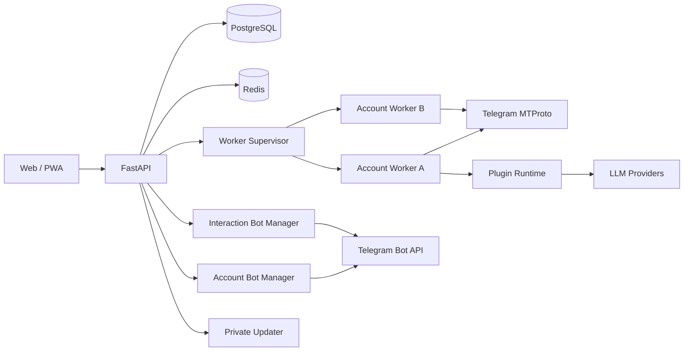

# TelePilot

[](LICENSE)
[](backend/pyproject.toml)
[](frontend/package.json)
[](CHANGELOG.md)
[](#项目状态)

自托管的 Telegram 多账号 UserBot 控制台。

TelePilot 把多个 Telegram 账号、插件、交互 Bot、AI 路由、资金台账、Webhook、日志和在线更新放进一个 Web/PWA 工作台。每个账号由独立 Worker 子进程运行，适合希望自己掌握数据、密钥和自动化规则的个人用户或小团队。

> TelePilot 操作的是 Telegram 用户账号，不是普通 Bot API 托管服务。自动回复、群发、频繁操作和第三方插件都可能带来账号风控或安全风险。请在理解风险后使用，并遵守 Telegram 规则和当地法律。

## 界面预览

<p align="center">
  
  
</p>

<p align="center">
  
  
</p>

<details>
<summary>查看更多桌面与 PWA 截图</summary>

<br />

<p align="center">
  
  
</p>

<p align="center">
  
  
</p>

<p align="center">
  
  
</p>

</details>

## 主要能力

| 领域 | 当前能力 |
| --- | --- |
| 多账号 | Web 向导绑定 Telegram 账号，每账号独立 Worker、session、代理、设备参数、插件配置和运行状态 |
| 生命周期 | Supervisor 管理启动、停止、重连、退避和状态同步；关键组件启动失败会自动重试并进入 `/readyz` |
| 插件 | 支持官方插件库、本地插件、ZIP 安装、按账号启停、热重载、权限声明、配置页面和版本检查 |
| 群互动 | 独立 Interaction Bot manager 承接关键词、按钮、付款确认和群会话；管理命令与资金动作仍由 UserBot 执行 |
| AI | 支持 OpenAI 兼容接口、Anthropic Messages 协议和 Ollama 兼容接口，包含模型级路由、Provider tag、协议诊断、测活、usage 和预算 |
| 资金 | Action ledger、payout 限额、持久化幂等、失败补偿、ambiguous 人工核对和按账号查询 |
| 可观测性 | Runtime/Audit 日志、Trace、action event、消息路由漏斗、reason code、系统健康和资源状态 |
| 开发工具 | 插件脚手架、静态权限推导、dry-run、命中调试、录制回放、Webhook 和分级 Trace |
| 运维 | Docker Compose、备份恢复、在线增量更新、全局紧急停用、PWA 和移动端布局 |

## 运行模型



- FastAPI 负责 Web API、认证、配置、两个 Bot manager 和 Worker Supervisor。
- 每个已运行账号对应一个独立 Worker 子进程，Worker 内运行 Telethon、插件和调度器。
- PostgreSQL 保存业务数据和加密后的敏感字段；Redis 用于 IPC、租约、去重、限速和短期状态。
- `/healthz` 只表示进程存活；`/readyz` 还检查 PostgreSQL、Redis、Supervisor 和两个 Bot manager。
- 命令会话默认使用 UserBot，关键词、付款和按钮会话默认使用 Interaction Bot；`payout` 固定使用 UserBot。

详细边界见 [架构说明](docs/TELEPILOT-ARCHITECTURE.md)。

## 快速开始

### 本机试用

需要 Python 3.12 或 3.13、Docker Desktop 或 Docker Engine、Docker Compose v2、pnpm、curl 和 `make`。

```bash
git clone https://github.com/Anoyou/telebot telepilot
cd telepilot
make up
```

启动后访问：

- Web 前端：[http://localhost:5173](http://localhost:5173)
- FastAPI 文档：[http://localhost:8000/docs](http://localhost:8000/docs)

常用命令：

```bash
make status
make logs
make restart
make down
```

### VPS 一键安装

适用于 Ubuntu 或 Debian 服务器：

```bash
curl -fsSL https://raw.githubusercontent.com/Anoyou/telebot/main/scripts/install-server.sh | bash
```

默认安装到 `/opt/telepilot`。公网部署前请继续完成 HTTPS、强密钥、备份和反向代理配置，见 [公网部署指南](docs/DEPLOY-PUBLIC.md)。

### 已克隆仓库的生产部署

```bash
make init-prod-env
make prod-up
```

生产 Compose 包含 PostgreSQL、Redis、FastAPI/Worker、前端 Nginx 和内网 Updater。业务数据、Telegram session、已安装插件和插件仓库缓存使用持久化卷。

## 第一次使用

1. 在 [my.telegram.org](https://my.telegram.org) 申请 Telegram `API ID` 和 `API Hash`。
2. 打开 TelePilot，注册第一个 Web 管理员。
3. 通过账号向导绑定 Telegram 账号并完成验证码或两步密码验证。
4. 按需配置账号代理、Interaction Bot、通知 Bot、AI Provider 和插件。
5. 先用 dry-run、命中调试和日志确认规则，再开启自动动作或 payout。

大部分业务配置都在 Web 面板完成。`.env` 主要保存服务启动前必须知道的密钥、数据库连接、端口、反代信任和资源限制。

## 安全与正确性边界

- `MASTER_KEY` 用于加密 Telegram session、API Hash、Bot Token、Webhook Token、TOTP secret 和 LLM Key。丢失后旧密文无法恢复，请单独备份。
- 公网环境必须使用 HTTPS，设置强 `JWT_SECRET` 和数据库密码，并限制后端端口只在可信网络可见。
- TelePilot 采用个人可信插件模型，不提供公共插件市场式强沙箱。新 ZIP 默认拒绝未签名安装；历史未签名插件使用独立兼容开关。
- Webhook Token 使用 `MASTER_KEY` 加密落库，默认只接受 `X-TelePilot-Webhook-Token` 请求头；公开入口在访问数据库前另有 IP 限流。
- payout 限额、AI 预算、关键风控和交互 claim 在依赖故障时采用 fail-closed。
- payout 遇到超时或未知发送结果时进入 ambiguous，不会把异常简单视为未发送后自动重付。
- 全局紧急停用会同时收敛 Worker、Account Bot 和 Interaction Bot；部分失败会返回 `KILL_SWITCH_PARTIAL_FAILURE`。
- Updater 可以控制宿主机 Docker，必须使用独立 `UPDATER_TOKEN`，不能和 `JWT_SECRET` 复用。

生产检查和应急流程见 [安全运维 SOP](docs/SECURITY-OPS.md)。

## 插件开发

TelePilot 的标准插件链路由 Event Bus、标准事件信封、MessageOps/action 和 Trace 组成。普通插件不需要接触 Bot Token 或 Telegram session。

```bash
make plugin-new name=my_game profile=session_game
make plugin-check dir=plugins/local_imports/my_game
make plugin-register dir=plugins/local_imports/my_game
```

开发时建议按这个顺序：

1. 用脚手架生成 `plugin.json`、`manifest.py`、`plugin.py` 和测试。
2. 声明 `usage`、`event_subscriptions`、`capabilities` 和实际需要的权限。
3. 用 `plugin-check` 检查事件和权限，再登记到本地插件台账。
4. 在账号上开启 dry-run，使用命中调试和短期 router trace 验证入口。
5. 涉及 payout 时提供稳定幂等键，不要在插件内自行补发。

入口文档：

- [5 分钟 Quickstart](docs/PLUGIN-QUICKSTART.md)
- [入站 Webhook Quickstart](docs/PLUGIN-WEBHOOK-QUICKSTART.md)
- [插件开发铁律](docs/PLUGIN-RULES.md)
- [插件 API 参考](docs/PLUGIN-API-REFERENCE.md)
- [插件安全边界](docs/PLUGIN-SAFETY.md)
- [开发者工具链](docs/PLUGIN-DEVTOOLS.md)

## 源码开发

开发环境需要 Python 3.12 或 3.13、pnpm 10 和 Docker。

```bash
make bootstrap
make dev-up
make migrate
```

分别启动后端和前端：

```bash
make backend
make frontend
```

常用验证：

```bash
make lint
make test
pnpm --dir frontend typecheck
pnpm --dir frontend build
backend/.venv/bin/python scripts/validate-plugin-examples.py
backend/.venv/bin/python scripts/validate-installed-interaction-plugins.py
```

## 文档

| 任务 | 文档 |
| --- | --- |
| 安装、升级、备份和回滚 | [公网部署](docs/DEPLOY-PUBLIC.md) |
| 生产安全、应急停用和资金巡检 | [安全运维](docs/SECURITY-OPS.md) |
| 组件、数据流和生命周期 | [架构说明](docs/TELEPILOT-ARCHITECTURE.md) |
| 插件文档入口 | [插件开发指南](docs/PLUGIN-DEV-GUIDE.md) |
| 插件字段、事件、action 和生命周期 | [插件 API 参考](docs/PLUGIN-API-REFERENCE.md) |
| 外部系统通过 HTTP 触发插件 | [入站 Webhook Quickstart](docs/PLUGIN-WEBHOOK-QUICKSTART.md) |
| 插件 HTTP 与 AI 能力 | [HTTP facade](docs/PLUGIN-HTTP.md) / [AI facade](docs/PLUGIN-AI.md) |
| 远程插件仓库与发布 | [远程插件](docs/PLUGIN-REMOTE.md) |
| 版本变化 | [CHANGELOG](CHANGELOG.md) |
| 参与开发 | [CONTRIBUTING](CONTRIBUTING.md) / [Agent Playbooks](docs/AGENT-PLAYBOOKS.md) |

## 技术栈

- Backend: Python 3.12, FastAPI, SQLAlchemy 2, Alembic, PostgreSQL 16, Redis 7, Telethon
- Frontend: React 18, TypeScript, Vite 5, Tailwind CSS, TanStack Query, Radix UI, PWA
- Runtime: multiprocessing spawn, 每账号独立 Worker, Redis IPC
- Deployment: Docker Compose, Nginx, private Updater

## 项目状态

当前源码版本：`0.57.8`。

项目处于 Alpha 阶段，主要面向自托管和个人可信环境。接口、页面和插件契约仍可能调整；升级前请阅读 [CHANGELOG](CHANGELOG.md) 并完成备份。较大的功能改动建议先开 issue 对齐方向。

仓库历史名称仍是 `Telebot`，部分数据库默认值、Docker volume 和兼容字段也保留旧名称，避免已有部署升级后连接到空数据。产品名称和界面统一使用 TelePilot。

## License

[MIT](LICENSE)

## 致谢

- [Telethon](https://github.com/LonamiWebs/Telethon)
- [FastAPI](https://fastapi.tiangolo.com/)
- [React](https://react.dev/)
- [Tailwind CSS](https://tailwindcss.com/)
